# Memory System Architecture

This diagram illustrates the complete memory system architecture, including data flow, decision logic, parallel extraction, and storage.

```mermaid
graph TB
    %% Entry Point
    UserMsg[User Message] --> AppendUser[Append to Working Memory]
    AgentResp[Agent Response] --> AppendAgent[Append to Working Memory]
    AppendUser --> Hook1[AFTER_APPEND Hook]
    AppendAgent --> Hook2[AFTER_APPEND Hook]

    %% User Message Path - Semantic Extraction
    Hook1 --> CheckUserTrivial{Is user message<br/>trivial?}
    CheckUserTrivial -->|Yes + Below Threshold| SkipSemantic[Skip Semantic]
    CheckUserTrivial -->|No| CheckThreshold1{Token count ≥<br/>threshold?}
    CheckThreshold1 --> BuildTreeUser[Build Tree:<br/>Semantic + Compaction*]

    BuildTreeUser --> SemanticNode[Semantic Memory Task]
    SemanticNode --> ReadSemantic[Read existing<br/>semantic.md]
    ReadSemantic --> FormatCtxSem[Format context<br/>last 5 items]
    FormatCtxSem --> SemanticLLM[LLM: Extract facts]
    SemanticLLM --> SemanticPrompt["PROMPT:<br/>- Normalize temporal refs<br/>- Remove context<br/>- Atomic facts<br/>- Deduplication"]
    SemanticPrompt --> SemanticFacts[List of<br/>SemanticFact]
    SemanticFacts --> WriteSemantic[Append to<br/>semantic.md]

    %% Agent Response Path - Episodic Extraction
    Hook2 --> CheckAgentTrivial{Was user message<br/>trivial?}
    CheckAgentTrivial -->|Yes + Below Threshold| SkipEpisodic[Skip Episodic]
    CheckAgentTrivial -->|No| CheckThreshold2{Token count ≥<br/>threshold?}
    CheckThreshold2 --> BuildTreeAgent[Build Tree:<br/>Episodic + Compaction*]

    BuildTreeAgent --> EpisodicNode[Episodic Memory Task]
    EpisodicNode --> ReadEpisodic[Read recent<br/>episodic events<br/>last 10]
    ReadEpisodic --> FormatCtxEpi[Format context<br/>last 5 items]
    FormatCtxEpi --> ExtractAgentResp[Extract agent<br/>response<br/>LATEST!]
    ExtractAgentResp --> EpisodicLLM[LLM: Extract events]
    EpisodicLLM --> EpisodicPrompt["PROMPT:<br/>- 6 event types<br/>- User + Agent pair<br/>- What changed?<br/>- Deduplication"]
    EpisodicPrompt --> EpisodicEvents[List of<br/>EpisodicEvent]
    EpisodicEvents --> FormatTimestamp[Format with<br/>timestamp + type]
    FormatTimestamp --> WriteEpisodic[Append to<br/>episodic.md]

    %% Compaction (can happen on either path if threshold exceeded)
    BuildTreeUser -.->|If threshold exceeded| CompactNode[Compact Memory Task]
    BuildTreeAgent -.->|If threshold exceeded| CompactNode
    CompactNode --> ReadOldItems[Read old items<br/>keep last 5]
    ReadOldItems --> CompactLLM[LLM: Summarize context]
    CompactLLM --> CreateCompaction[Create Compaction object]
    CreateCompaction --> ReplaceItems[Replace old items<br/>with compaction]

    %% Convergence
    ReplaceItems --> UpdateWorking[Write working.md]
    WriteSemantic --> UpdateWorking
    WriteEpisodic --> UpdateWorking
    SkipSemantic --> UpdateWorking
    SkipEpisodic --> UpdateWorking

    UpdateWorking --> Done[Return updated items]

    %% Storage Layer
    subgraph Storage["💾 Persistent Storage"]
        WorkingFile[".memory/working.md<br/>─────────<br/>Current conversation<br/>U: user messages<br/>A: assistant responses<br/>T: tool calls<br/>C: compactions"]
        SemanticFile[".memory/semantic.md<br/>─────────<br/>Timeless facts<br/>- User has two dogs<br/>- Nina was born ~2011<br/>- User prefers Python"]
        EpisodicFile[".memory/episodic.md<br/>─────────<br/>Timestamped events<br/>## 02-16 15:28<br/>- event | context<br/>- event<br/>- event | context"]
    end

    WriteSemantic -.-> SemanticFile
    WriteEpisodic -.-> EpisodicFile
    UpdateWorking -.-> WorkingFile

    %% Memory Retrieval/Usage Flow
    subgraph Retrieval["🔍 Memory Retrieval (During Agent Execution)"]
        ThinkTool[think tool]
        RespondTool[respond tool]
    end

    WorkingFile -->|get_recent_context<br/>last 3 items| ThinkTool
    EpisodicFile -->|get_recent_episodic_events<br/>last 5 events| ThinkTool
    WorkingFile -->|get_conversation_pairs<br/>last 3 U/A pairs| RespondTool
    EpisodicFile -->|get_recent_episodic_events<br/>last 5 events| RespondTool
    SemanticFile -->|read_text<br/>background facts| RespondTool

    ThinkTool --> DecideNextTool[Decide next tool<br/>read_files / respond]
    RespondTool --> GenerateResponse[Generate response<br/>with context + facts]

    %% Styling
    classDef decision fill:#ff9800,stroke:#e65100,stroke-width:2px,color:#fff
    classDef process fill:#2196f3,stroke:#0d47a1,stroke-width:2px,color:#fff
    classDef storage fill:#4caf50,stroke:#1b5e20,stroke-width:2px,color:#fff
    classDef model fill:#9c27b0,stroke:#4a148c,stroke-width:2px,color:#fff
    classDef llm fill:#f44336,stroke:#b71c1c,stroke-width:3px,color:#fff
    classDef retrieval fill:#00bcd4,stroke:#006064,stroke-width:2px,color:#fff

    class CheckTrivial,CheckThreshold,ParallelTasks decision
    class CompactNode,SemanticNode,EpisodicNode,TreeExec process
    class WorkingFile,SemanticFile,EpisodicFile storage
    class CompactLLM,SemanticLLM,EpisodicLLM llm
    class ThinkTool,RespondTool,DecideNextTool,GenerateResponse retrieval
```



## System Overview

### 1. **Startup: Load Working Memory**
- On first initialization, `load_working_memory()` reads `.memory/working.md`
- Parses items back into typed dataclasses (UserMessage, AssistantResponse, ToolCall, Compaction)
- Restores conversation context from previous session
- Located in `app/memory/hooks.py`, called by `get_working_memory()` factory

### 2. **Entry Point: AFTER_APPEND Hook**
- Triggered whenever items are appended to working memory
- Located in `app/memory/hooks.py`
- Orchestrates the entire memory pipeline
- **Extraction on user messages:**
  - **User message appended** → Triggers both semantic AND episodic extraction
  - **Agent response appended** → No extraction (agent actions logged deterministically by tools)

### 3. **Decision Logic**

#### Trivial Message Detection
Messages are skipped if they match patterns like:
- Single-word responses: "ok", "yes", "no", "thanks"
- Very short messages (≤2 words)
- Common acknowledgments: "got it", "understood"

#### Extraction Triggers
- **Semantic memory**: Extracted when a non-trivial USER message is appended
- **Episodic memory (LLM)**: Extracted when a non-trivial USER message is appended (captures user intent)
- **Episodic memory (Deterministic)**: Logged by tools as they execute (captures agent actions)

#### Token Threshold
- Threshold defined in `WORKING_MEMORY_TOKEN_THRESHOLD`
- Uses `tiktoken` (cl100k_base encoding) for counting
- Triggers compaction when exceeded
- Can occur on either path (user or agent)

### 4. **Task Execution**

The system uses **TreeExecutor** from the `grafo` library to run tasks:

```python
# On User Message:
TreeExecutor(roots=[
    Node(coroutine=extract_semantic_memory),  # Always (if not trivial)
    Node(coroutine=extract_episodic_memory),  # Always (if not trivial) - captures user intent
    Node(coroutine=compact_memory),           # If threshold exceeded
])

# On Agent Response:
# No extraction - agent actions logged deterministically by tools
```

### 5. **Memory Types**

| Memory Type | Purpose | Characteristics | Example | Used By |
|-------------|---------|-----------------|---------|---------|
| **Working** | Current conversation | Structured items (U/A/T/C) | `U: What's Nina's age?` | `think`, `respond` |
| **Semantic** | Timeless facts | Normalized, decontextualized | `Nina was born around 2011` | `respond` |
| **Episodic** | Timestamped events | Categorized interactions | `[knowledge_retrieval] User asked about Nina` | `think`, `respond` |

### 6. **Extraction Pipelines**

#### Semantic Memory
**Trigger:** Runs after user message is appended to memory

1. Read existing `semantic.md` (for deduplication)
2. Format last 3 conversation items
3. LLM extracts normalized facts from user message
4. Append facts to file

**Normalization Rules:**
- Remove temporal language ("recently", "yesterday")
- Convert relative time to absolute (age → birth year)
- Strip conversational context ("user mentioned")
- One concept per fact (atomic)

#### Episodic Memory
**Trigger:** Hybrid approach for optimal efficiency

**LLM Extraction (User Messages):**
1. Triggered when user message is appended to memory
2. Read last 5 episodic events (for deduplication)
3. LLM extracts user intent/actions from user message
4. Format with timestamp and structured fields
5. Append to file

**Deterministic Logging (Agent Actions):**
1. Tools log their own events as they complete
2. Uses `log_episodic_event()` helper function
3. No LLM overhead - events are created directly
4. Examples: file reads, errors, tool completions

**Event Structure:**

Each event is a simple, atomic statement with optional context:

```
event | context (optional)
```

**Fields:**
- `event`: What happened in past tense, includes who did what (e.g., "user asked about Nina", "agent read 3 files")
- `context`: (Optional) Essential outcome or detail (1 short phrase)

**Design Principles:**
- **Atomic**: One action per event (compound interactions split into multiple events)
- **Fact-based**: Past tense, no narrative language ("user obtained items" not "User shared that they obtained items")
- **Simple**: Minimal structure, maximum clarity
- **Concise**: Context only when essential

**Format Examples:**

```markdown
## 02-16 15:28

- user obtained Diablo IV unique items | incompatible with poison build
- user asked about prior conversation
- agent read 3 files | config.py, main.py, utils.py
- user requested debugging help
```

**Key Optimization:** Hybrid extraction reduces LLM calls by 50% and token usage by ~60%:
- **User actions** require LLM interpretation (intent, context, facts)
- **Agent actions** are logged deterministically (we already know what tools were called)

**Deterministic Logging API:**
```python
from app.memory import log_episodic_event

log_episodic_event(
    event="agent read 3 files",
    context="config.py, main.py, utils.py"
)
```

#### Compaction
1. Keep last 5 items intact
2. Summarize older items via LLM
3. Replace old items with single `Compaction` object
4. Preserves: intents, file paths, decisions, outcomes

### 7. **Storage Format**

```markdown
# .memory/working.md
U: Hey, do you know Nina?
A: Yes, Nina is a Pomeranian born around 2011.
U: Her fur is orange.
A: I've noted that Nina's fur is orange.

---

# .memory/semantic.md
- User has a dog named Nina
- Nina is a Pomeranian
- Nina was born around 2011
- Nina's fur is orange

---

# .memory/episodic.md
## 02-16 15:28

- user asked about Nina
- agent recalled Nina's details | Pomeranian born 2011
- user provided Nina's fur color | orange
```

### 8. **Type Safety**

The system uses typed dataclasses with type guards:

```python
@dataclass
class UserMessage(MemoryItem):
    content: str
    type: Literal["user"] = "user"

# Type guard
def is_user_message(item: MemoryItemType) -> TypeGuard[UserMessage]:
    return isinstance(item, UserMessage)
```

### 9. **Key Design Patterns**

1. **Persistence**: Working memory persists across sessions via `working.md`
2. **Orchestrator Pattern**: `hooks.py` coordinates all extraction
3. **Hybrid Extraction**: LLM for user intent, deterministic for agent actions
4. **Deduplication**: Extractors read existing memory before running
5. **Separation of Concerns**: Three distinct memory types, each optimized for different use cases
6. **Type Safety**: Strongly-typed dataclasses with runtime guards
7. **LLM-Driven**: Structured extraction using Pydantic response models

### 10. **Memory Retrieval & Usage**

#### How Memory is Used During Agent Execution

**think tool** (`app/agent/tools/think.py`):
- **Purpose**: Decide which tool to use next (read_files or respond)
- **Memory sources**:
  - `get_recent_context(memory, n=3)` → Last 3 items from working memory
  - `get_recent_episodic_events(n=5)` → Last 5 events from episodic.md
- **Context provided to LLM**:
  - Recent conversation flow (what just happened)
  - Episodic patterns (what kind of interactions occurred)
- **Decision**: Routes to appropriate tool based on recent context + event patterns

**respond tool** (`app/agent/tools/respond.py`):
- **Purpose**: Generate natural response to user
- **Memory sources**:
  - `get_conversation_pairs(memory, n=3)` → Last 3 user-assistant pairs from working memory
  - `get_recent_episodic_events(n=5)` → Last 5 events from episodic.md
  - Direct read from `semantic.md` → All timeless facts
- **Context provided to LLM**:
  - Recent conversation pairs (immediate context)
  - Recent interaction history (episodic events - enables recall across sessions)
  - Background knowledge (persistent facts about user, preferences, entities)
- **Output**: Informed response combining recent dialogue + interaction history + long-term knowledge
- **Key benefit**: Can answer "what were we talking about?" even after restart by reading episodic memory

#### Query Functions

Located in `app/memory/queries.py`:

```python
get_recent_context(memory, n=3)           # Last N items from working memory
get_recent_episodic_events(n=5)           # Last N events from episodic.md
get_user_messages_only(memory, n=5)       # Filter to user messages
get_conversation_pairs(memory, n=3)       # User-assistant pairs
```

### 11. **Configuration**

- **Token Threshold**: `WORKING_MEMORY_TOKEN_THRESHOLD` in `app/core/config.py`
- **Compaction Keep**: 5 most recent items
- **Context Window**: 3 items for semantic extraction only (episodic uses no conversation context)
- **Dedup Window**: 5 events for episodic (optimized for token efficiency)

---

## File Locations

```
app/memory/
├── hooks.py                    # Entry point, orchestration
├── queries.py                  # Memory accessor functions
├── dataclasses.py              # Typed memory items
└── extractors/
    ├── __init__.py
    ├── compact.py              # Compaction logic
    ├── semantic.py             # Semantic fact extraction
    └── episodic.py             # Episodic event extraction

.memory/
├── working.md                  # Current conversation
├── semantic.md                 # Timeless facts
└── episodic.md                 # Timestamped events
```
