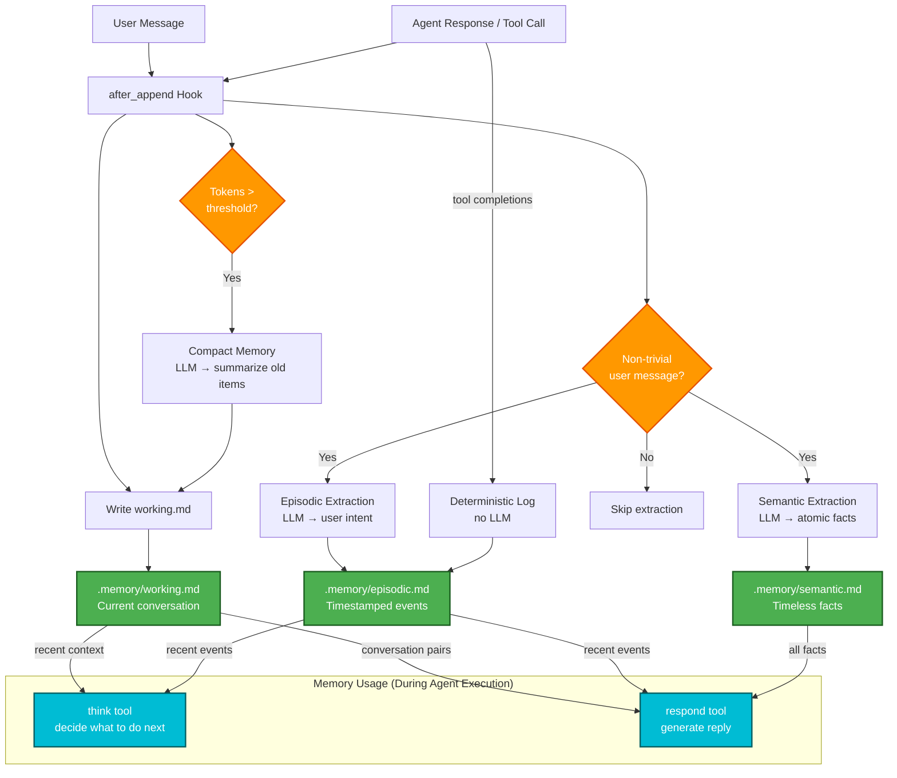

:warning: This is highly dependent on LLM model choice. At 01/03/2026, gpt-5-mini with 'low' reasoning effort was a good choice. :warning:

# Memory System Architecture



## System Overview

A single `after_append` hook (`app/memory/hooks.py`) fires on every context queue append. It writes the updated conversation to `working.md`, then decides whether to run extraction:

- **Non-trivial user message** → runs semantic + episodic extraction in parallel via LLM
- **Token threshold exceeded** → runs compaction (summarizes old items, keeps last 5)
- **Tool completions** → episodic events logged deterministically (no LLM)
- **Trivial messages** ("ok", "yes", "thanks") → skip extraction

### Memory Types

| Type | File | Purpose | Written by |
|------|------|---------|------------|
| **Working** | `working.md` | Active conversation (U/A/T/C items) | Every append |
| **Semantic** | `semantic.md` | Timeless, normalized facts | LLM on user message |
| **Episodic** | `episodic.md` | Timestamped events | LLM (user intent) + deterministic (agent actions) |

### Hybrid Episodic Extraction

User actions require LLM interpretation; agent actions don't — we already know what tools ran. This halves LLM calls for episodic logging.

```python
# Tools log their own events directly:
from app.memory import log_episodic_event
log_episodic_event(event="agent read 3 files", context="config.py, main.py, utils.py")
```

### Storage Format

```
# working.md
U: Hey, do you know Nina?
A: Yes, Nina is a Pomeranian born around 2011.

# semantic.md
- User has a dog named Nina
- Nina is a Pomeranian born around 2011
- Nina's fur is orange

# episodic.md
## 02-16 15:28
- user asked about Nina
- user provided Nina's fur color | orange
```
